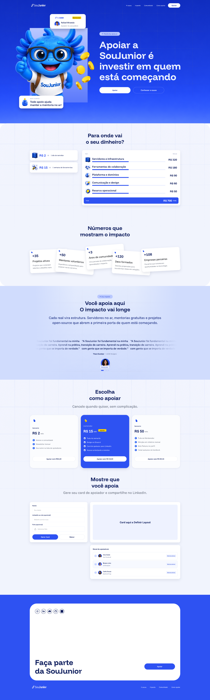

# Referência do design — MCP Pencil

Captura de 23/09/2026 de `pendev.pen`, obtida com `get_app_state`, `execute/Get`, `GetVariables` e `Export`. O arquivo `.pen` não foi lido como texto pelo filesystem.

## Cobertura e limites

- **836 nós**, **25 elementos no primeiro nível**, **434 nós no Desktop**.
- O snapshot contém propriedades expostas de todos os nós: hierarquia, ordem, nomes, textos, geometria de paths, posições, dimensões, layout, preenchimentos, tipografia, efeitos e referências.
- [Snapshot completo](pencil-snapshot.json): cada registro tem `parentId`, `depth`, `index`, `bounds` e `properties`. `index` é a ordem entre irmãos; `bounds` é o retângulo resolvido no sistema de coordenadas do pai, não necessariamente as dimensões locais antes da rotação. `properties` preserva os valores originais expostos.
- [Referências por imagem](asset-references.json) e [manifesto dos arquivos](asset-manifest.json).
- Variáveis vazias; nenhum componente marcado como reutilizável; nenhum nó `ref`, `script`, `browser`, `icon` ou preenchimento shader encontrado.
- A API não expôs `imports`, versão do documento ou metadados da raiz. Não afirmar ausência absoluta de `.lib.pen` ou outros imports apenas por não haver referências nos nós.
- O JSON é um registro de auditoria, **não um substituto importável do `.pen`**. PNGs de referência não contêm camadas editáveis.
- A extração registra uma fotografia do documento. Mudanças posteriores no Pen.dev exigem nova captura.

## Fonte visual principal

O frame `Desktop` (`EAVtG`) é a landing page escolhida. Os demais elementos são referências/variantes do canvas, não rotas adicionais ou requisitos automáticos.

Prévia exportada pelo MCP em escala 0,5: 960 × 3186, incluindo a extensão dos filhos além da altura declarada da raiz. A prévia do hero mede 960 × 562. Medidas abaixo estão em pixels do design original.

## Primeiro nível do documento

| ID | Nome | Tipo | X | Y | Largura | Altura |
|---|---|---|---:|---:|---:|---:|
| `EAVtG` | Desktop | frame | -3626 | -20212 | 1920 | 6340 |
| `v1Tev` | home | frame | 1582.64 | -16446.34 | 1920 | 1123 |
| `y6UAc` | home | frame | 1620.64 | -18226.34 | 1920 | 1123 |
| `m1H1u` | home | frame | -299.36 | -14049.34 | 1920 | 1123 |
| `w29pan` | card | frame | 4205.64 | -14248.34 | 373 | 477.56 |
| `vplyi` | ChatGPT Image Sep 22, 2026, 06_48_49 PM 1 | rectangle | 4476.64 | -14222.34 | 284.76 | 418.7 |
| `V2HRoE` | Frame 11 | frame | 5193.64 | -14152.34 | 404 | 116 |
| `C7UyeA` | card-mantenedor | frame | 4813.64 | -14152.34 | 328 | 133.3 |
| `fiiVt` | Supporter Row | frame | 6301.64 | -14113.34 | 776 | 68 |
| `u8jaKJ` | Input / Text | frame | 5709.64 | -14079.34 | 480 | 48 |
| `b8P2d` | card-mantenedor | frame | -383.36 | -14929.34 | 328 | 133.3 |
| `e7V0DG` | Button / Primary / On Blue | frame | -397.36 | -14466.34 | 704 | 96 |
| `ve67c` | card-mantenedor | frame | 37.64 | -15006.34 | 350 | 210 |
| `dRlbq` | Text | text | -3077.36 | -14394.34 | 0 | 15 |
| `StBb3` | Text | text | -3077.36 | -14394.34 | 0 | 15 |
| `bDw5g` | Text | text | -3077.36 | -14394.34 | 0 | 15 |
| `oycou` | 02 · Causa e transparência | frame | -1569.36 | -16371.34 | 1376 | 794 |
| `SOXbb` | Card / Tradução de valor | frame | -6.36 | -16373.34 | 470 | 236 |
| `nfYL6` | Tabela / Linha de transparência | frame | -6.36 | -16113.34 | 674 | 460 |
| `BmYje` | Tabela / Linha total | frame | -6.36 | -15613.34 | 642 | 57 |
| `K1nqT` | ChatGPT Image Sep 22, 2026, 08_53_05 PM 1 | rectangle | -193 | -19088 | 460.5 | 506.8 |
| `exT1w` | badge | frame | -403.36 | -14691.34 | 142 | 120 |
| `J4Rp5` | review-01 | frame | 563.64 | -15111.34 | 86.5 | 289 |
| `hvXmW` | ChatGPT Image Sep 22, 2026, 06_48_52 PM 2 | rectangle | 636 | -12731 | 886.41 | 971.84 |
| `dpHqk` | ChatGPT Image Sep 22, 2026, 06_48_52 PM 2 | rectangle | 302.98 | -18459 | 894.93 | 982.9 |

## Seções do Desktop

O frame externo mede **1920 × 6340**. Seu container vertical `F1TIs` mede **1920 × 6372**: há diferença de 32 px entre a altura da raiz e a composição interna; isso é um dado observado, não corrigido nesta documentação.

| ID | Nome | Y no container | Dimensões resolvidas |
|---|---|---:|---|
| `G8k5su` | home | 0 | 1920 × 1123 |
| `XWN8T` | section-2-3 | 1123 | 1920 × 1480 |
| `d1xXmo` | section-4-5 | 2603 | 1920 × 853 |
| `kNNhp` | section-6 | 3456 | 1920 × 1958 |
| `xZ1d6` | footer | 5414 | 1920 × 958 |

## Hero: contrato de composição

`G8k5su`: 1920 × 1123, layout absoluto, `clip: true`. Nesta captura, o nó não declara `cornerRadius`; o CSS web ainda usa cantos arredondados. A ordem abaixo é a ordem real de pintura dos filhos.

| Ordem | ID | Camada | X local | Y local | Largura local/resolvida | Altura local/resolvida |
|---:|---|---|---:|---:|---:|---:|
| 0 | `W3sve` | ChatGPT Image Sep 22, 2026, 06_46_33 PM 1 | -7.98 | -80 | 1935.96 | 1213 |
| 1 | `T6Vj7` | ChatGPT Image Sep 22, 2026, 06_56_51 PM 1 | -1.27 | -197 | 1922.53 | 1082 |
| 2 | `SMH31` | Mascot background rectangle | 271.89 | 255 | 529.21 | 677.56 |
| 3 | `EiMyw` | Mascot clipped to light background | 0 | 255 | 1000 | 677.56 |
| 4 | `PVgNq` | Coins independent layer | 703.68 | 444 | 209.45 | 372.16 |
| 5 | `otrfJ` | top-bar | 0 | 0 | 1920 | 99 |
| 6 | `OrFoC` | Frame 6 | 909 | 291 | 780 | 558 |
| 7 | `Yb7F3` | card-mantenedor | 456 | 128 | 328 | 133.3 |
| 8 | `uCbVF` | Frame 11 | 174.89 | 871 | 404 | 116 |
| 9 | `D7Mx2W` | Mascot hair overlay | 271.89 | 70 | 529.21 | 120 |

### Regras que precisam ser preservadas

1. Fundo e grade são camadas próprias (`image-import-17.png` e `image-import-8.png`).
2. `SMH31` é o retângulo azul claro, independente do mascote. Gradiente `#b9c8ff` → `#5b79fb`; posição (271,89; 255), tamanho 529,21 × 677,56.
3. `EiMyw` é o recorte do corpo: (0; 255), 1000 × 677,56, `clip: true`. Sua largura permite escape lateral em relação ao retângulo, mas limita a parte inferior em Y ≈ 932,56.
4. `s5HLt1`, dentro desse recorte, usa `image-import-7.png`, posição local (350; −297,58), 620,08 × 1101,77, rotação −23,926° no Pencil.
5. `PVgNq` mantém as moedas independentes, com `image-import-49.png`, rotação −11,576°.
6. `Yb7F3` e `uCbVF` são cards independentes acima da arte; não os incorporar ao bitmap do mascote.
7. `D7Mx2W` é a camada final do cabelo, posição (271,89; 70), 529,21 × 120, com `clip: true`. Contém `OYht1` usando a mesma imagem, posição local (78,11; −112,58), 620,08 × 1101,77 e rotação −23,926°. Sua ordem permite passar sobre o card branco.
8. A copy permanece à direita em `OrFoC` (909; 291), largura 780. O header tem padding horizontal de 272.
9. Não recriar o wrapper antigo que prendia mascote e fundo no mesmo recorte. Não reduzir a largura externa do hero em relação às outras seções.
10. Rotações do Pencil são anti-horárias; a conversão para CSS exige considerar o sinal e a origem. `bounds` já incorpora a transformação e não deve ser confundido com o tamanho local da imagem.

## Tipografia observada no documento inteiro

| Família | Pesos declarados e quantidade de nós |
|---|---|
| Funnel Sans | 500: 27; 600: 65; 700: 6; normal: 73 |
| Funnel Display | 500: 9; 600: 3; 700: 41 |
| Inter | normal: 3 |

O h1 `bi0qE` usa Funnel Display 88/700; títulos principais usam Funnel Display 48/700; o título final usa 68/700. O documento inclui Inter em três nós de texto, enquanto a página web carrega somente Funnel Sans e Funnel Display. Não há URLs de arquivos de fonte nos nós.

## Conteúdo e aparência: diferenças conhecidas

- O canvas mantém textos provisórios, inclusive lorem ipsum e a prévia “Card aqui a Definir Layout”.
- A transparência visual mostra R$ 700/mês e categorias ilustrativas. A web mostra os gastos fornecidos pelo projeto, R$ 1.849,59 acumulados até setembro/2026.
- O canvas associa números a rótulos divergentes do briefing. A web usa 35 mentores, +50 pessoas empregadas, 3 projetos, 120 membros e 108 apoiadores.
- A web usa depoimentos fornecidos pelo projeto, não a frase repetida do canvas.
- A web tem uma única imagem `.hero-mascot`, sem equivalentes de `EiMyw`/`D7Mx2W`. A implementação do recorte e do cabelo ainda está pendente.
- Os benefícios dos planos e os ícones/canais do rodapé não são uma transcrição literal do canvas; a web remete às condições oficiais e usa links já fornecidos no projeto.
- O desenho do card gerado foi definido na implementação porque o frame é um placeholder. A prévia DOM e o PNG Canvas não são renderizações idênticas.

Essas diferenças são registradas para revisão. Este trabalho de documentação não alterou design nem código.

## Inventário de todos os nós

A lista preserva a hierarquia de cada elemento de primeiro nível. Dimensões são `bounds`; propriedades e textos completos estão no JSON, sem depender desta lista abreviada.

### Desktop — EAVtG

- `EAVtG` · Desktop · frame · 1920 × 6340
  - `F1TIs` · Desktop · frame · 1920 × 6372
    - `G8k5su` · home · frame · 1920 × 1123
      - `W3sve` · ChatGPT Image Sep 22, 2026, 06_46_33 PM 1 · rectangle · 1935.96 × 1213
      - `T6Vj7` · ChatGPT Image Sep 22, 2026, 06_56_51 PM 1 · rectangle · 1922.53 × 1082
      - `SMH31` · Mascot background rectangle · path · 529.21 × 677.56
      - `EiMyw` · Mascot clipped to light background · frame · 1000 × 677.56
        - `s5HLt1` · Mascot body clipped · rectangle · 1013.63 × 1258.58
      - `PVgNq` · Coins independent layer · rectangle · 279.87 × 406.62
      - `otrfJ` · top-bar · frame · 1920 × 99
        - `RY8Xc` · Frame 3 · frame · 164 × 67
          - `AeKtT` · image 19 · rectangle · 164 × 67
        - `E3m1n` · Frame 4 · frame · 495 × 40
          - `yDLzG` · Frame 2 · frame · 359 × 21
            - `MqFC9` · nav-link · frame · 49 × 21
              - `WOutJ` · A causa · text · 49 × 21
            - `Q1wtFB` · nav-link · frame · 52 × 21
              - `G04BTQ` · Impacto · text · 52 × 21
            - `f3wLld` · nav-link · frame · 81 × 21
              - `jRy5P` · Comunidade · text · 81 × 21
            - `HCona` · nav-link · frame · 81 × 21
              - `kWRlT` · Como apoiar · text · 81 × 21
          - `VTeua` · Button / Primary / On Blue · frame · 112 × 40
            - `IMxSf` · Rótulo · text · 48 × 24
      - `OrFoC` · Frame 6 · frame · 780 × 558
        - `x45vZ` · Frame 7 · frame · 188 × 34
          - `DlFnl` · Frame 8 · frame · 140 × 21
            - `NVegW` · Ellipse 1 · ellipse · 6 × 6
            - `B0CY1` · Apoiar a SouJunior é investir em quem está começan · text · 126 × 21
        - `Z27bNV` · Frame 9 · frame · 780 × 492
          - `bi0qE` · Apoiar a SouJunior é investir em quem está começan · text · 780 × 388
          - `n7aXh` · Frame 5 · frame · 592 × 56
            - `AWxom` · Button / Primary / On Blue · frame · 284 × 56
              - `Km950` · Rótulo · text · 48 × 24
            - `yT6a7` · Toggle / Button · frame · 284 × 56
              - `LzwrD` · Ícone · text · 13 × 25
              - `Z3hxSY` · Rótulo · text · 145 × 27
      - `Yb7F3` · card-mantenedor · frame · 328 × 133.3
        - `e64MJq` · Frame 10 · frame · 244 × 35.3
          - `wKNZM` · Frame 13 · frame · 244 × 35.3
            - `oh9yE` · image 21 · rectangle · 92 × 35.3
            - `LA1N9` · badge · frame · 80 × 22
              - `i7hzMx` · Apoiar a SouJunior é investir em quem está começan · text · 72 × 14
        - `rXdpY` · Frame 15 · frame · 244 × 54
          - `jpDL7` · Ellipse 2 · ellipse · 48 × 48
          - `H3twRH` · Frame 14 · frame · 158 × 54
            - `iOOpu` · Apoiar a SouJunior é investir em quem está começan · text · 158 × 29
            - `P1XDS` · Apoiar a SouJunior é investir em quem está começan · text · 158 × 21
      - `uCbVF` · Frame 11 · frame · 404 × 116
        - `xPxzo` · ChatGPT Image Sep 22, 2026, 08_09_42 PM 1 · rectangle · 72 × 84
        - `H227Wb` · Frame 10 · frame · 288 × 80
          - `dWMwz` · Apoiar a SouJunior é investir em quem está começan · text · 288 × 14
          - `l69VC6` · Apoiar a SouJunior é investir em quem está começan · text · 288 × 58
      - `D7Mx2W` · Mascot hair overlay · frame · 529.21 × 120
        - `OYht1` · Mascot hair visible above card · rectangle · 1013.63 × 1258.58
    - `XWN8T` · section-2-3 · frame · 1920 × 1480
      - `PNWqe` · section-3 · frame · 1920 × 653.35
        - `hX6tL` · Frame 6 · frame · 1186 × 124
          - `UXn8h` · Frame 9 · frame · 1186 × 116
            - `kBHZV` · Frame 19 · frame · 1186 × 116
              - `HTusY` · Apoiar a SouJunior é investir em quem está começan · text · 1186 × 116
              - `mGL2e` · Apoiar a SouJunior é investir em quem está começan · text · 1186 × 90
        - `A74B1y` · cards · group · 1380.84 × 289.35
          - `t5h2n` · card-mantenedor · frame · 357.8 × 223.28
            - `XsdWR` · Frame 15 · frame · 302 × 142
              - `snMTO` · Frame 14 · frame · 302 × 142
                - `BZFSt` · Apoiar a SouJunior é investir em quem está começan · text · 56 × 38
                - `dsfyy` · Frame 17 · frame · 302 × 92
                  - `Os6zI` · Apoiar a SouJunior é investir em quem está começan · text · 158 × 36
                  - `K6ZJud` · Apoiar a SouJunior é investir em quem está começan · text · 302 × 48
            - `d7RSbT` · ChatGPT Image Sep 22, 2026, 09_05_19 PM 1 · rectangle · 28 × 27
          - `sYppM` · card-mantenedor · frame · 368.21 × 242.01
            - `Kkv1u` · Frame 15 · frame · 302 × 142
              - `j4kTx` · Frame 14 · frame · 302 × 142
                - `m849UV` · Apoiar a SouJunior é investir em quem está começan · text · 56 × 38
                - `WQQOU` · Frame 17 · frame · 302 × 92
                  - `JEfU5` · Apoiar a SouJunior é investir em quem está começan · text · 228 × 36
                  - `Xl4t2` · Apoiar a SouJunior é investir em quem está começan · text · 302 × 48
            - `L7ujlu` · ChatGPT Image Sep 22, 2026, 09_05_19 PM 1 · rectangle · 28 × 27
          - `Z9bFFU` · card-mantenedor · frame · 365.87 × 237.68
            - `IKXo5` · Frame 15 · frame · 302 × 142
              - `p2ldn6` · Frame 14 · frame · 302 × 142
                - `Ks3iQ` · Apoiar a SouJunior é investir em quem está começan · text · 37 × 38
                - `tq3Qn` · Frame 17 · frame · 302 × 92
                  - `vY1xc` · Apoiar a SouJunior é investir em quem está começan · text · 227 × 36
                  - `kvagX` · Apoiar a SouJunior é investir em quem está começan · text · 302 × 48
            - `E6GH5O` · ChatGPT Image Sep 22, 2026, 09_05_19 PM 1 · rectangle · 28 × 27
          - `VzcZ0` · card-mantenedor-5 · frame · 362.17 × 230.98
            - `uQhKT` · Frame 15 · frame · 302 × 142
              - `M4ezJ` · Frame 14 · frame · 302 × 142
                - `BtJsp` · Apoiar a SouJunior é investir em quem está começan · text · 74 × 38
                - `dyfZW` · Frame 17 · frame · 302 × 92
                  - `i7AJZD` · Apoiar a SouJunior é investir em quem está começan · text · 161 × 36
                  - `fvofN` · Apoiar a SouJunior é investir em quem está começan · text · 302 × 48
            - `X0qOI` · ChatGPT Image Sep 22, 2026, 09_05_19 PM 1 · rectangle · 28 × 27
          - `y2Cme` · card-mantenedor · frame · 360.84 × 228.62
            - `oAdtY` · Frame 15 · frame · 302 × 142
              - `U71yJ` · Frame 14 · frame · 302 × 142
                - `nlbCy` · Apoiar a SouJunior é investir em quem está começan · text · 74 × 38
                - `cjTGF` · Frame 17 · frame · 302 × 92
                  - `g0KQat` · Apoiar a SouJunior é investir em quem está começan · text · 211 × 36
                  - `ttIRG` · Apoiar a SouJunior é investir em quem está começan · text · 302 × 48
            - `rC8qR` · ChatGPT Image Sep 22, 2026, 09_05_19 PM 1 · rectangle · 28 × 27
      - `h53ogj` · section-2 · frame · 1920 × 827
        - `x6GJM` · Frame 6 · frame · 1186 × 116
          - `zIaQF` · Frame 9 · frame · 1186 × 116
            - `N1lxb` · Apoiar a SouJunior é investir em quem está começan · text · 1186 × 116
        - `ONjaw` · content · frame · 1376 × 503
          - `fdRhU` · coluna/traducao-de-valor · frame · 438 × 204
            - `OnBi1` · cards/traducao · frame · 438 × 204
              - `O4p7s` · Card / Tradução de valor · frame · 438 × 94
                - `twqhp` · icon/valor-1 · frame · 54 × 54
                - `JbsLm` · valor · text · 59 × 34
                - `F1jbpo` · valor · text · 17 × 32
                - `IFboP` · resultado · text · 226 × 24
              - `r9X7lF` · Card / Tradução de valor · frame · 438 × 94
                - `Zcw1E` · icon/valor-2 · frame · 54 × 54
                - `Vs6Wq` · valor · text · 75 × 34
                - `y6RBw` · valor · text · 17 × 32
                - `B1H2v` · resultado · text · 210 × 24
          - `Uk1lo` · coluna/onde-vai-o-dinheiro · frame · 898 × 503
            - `wRixS` · card/onde-vai-o-dinheiro · frame · 898 × 503
              - `AojOp` · cabecalho/tabela · frame · 866 × 34
                - `nXuYm` · item · text · 25 × 14
                - `H9ech` · spacer · frame · 775 × 1
                - `EPQMY` · mensal · text · 38 × 14
              - `YzM9w` · Tabela / Linha de transparência · frame · 866 × 72
                - `J3Mxi` · icon/linha-1 · frame · 48 × 48
                - `wuZHC` · conteudo · frame · 670 × 45
                  - `M1pnN` · nome · text · 670 × 29
                  - `mOEna` · proporcao · frame · 670 × 8
                    - `YHob6` · preenchimento · frame · 335 × 8
                    - `Ncrit` · restante · frame · 335 × 4
                - `ixAx3` · valor · text · 92 × 30
              - `Gp0jb` · Tabela / Linha de transparência · frame · 866 × 72
                - `NRQBK` · icon/linha-2 · frame · 48 × 48
                - `lJatW` · conteudo · frame · 670 × 46
                  - `PRd36` · nome · text · 670 × 30
                  - `swgXD` · proporcao · frame · 670 × 8
                    - `Y1Gc0K` · preenchimento · frame · 335 × 8
                    - `LI6ub` · restante · frame · 335 × 4
                - `x0n46X` · valor · text · 92 × 30
              - `E5hl0q` · Tabela / Linha de transparência · frame · 866 × 72
                - `N3OnAO` · icon/linha-3 · frame · 48 × 48
                - `ullwH` · conteudo · frame · 670 × 45
                  - `mh49P` · nome · text · 670 × 29
                  - `y5uUat` · proporcao · frame · 670 × 8
                    - `y4Yewp` · preenchimento · frame · 335 × 8
                    - `mhgSU` · restante · frame · 335 × 4
                - `uNX9S` · valor · text · 92 × 30
              - `yzdwt` · Tabela / Linha de transparência · frame · 866 × 72
                - `BYMbE` · icon/linha-4 · frame · 48 × 48
                - `O8CmQ9` · conteudo · frame · 670 × 45
                  - `EF8Oe` · nome · text · 670 × 29
                  - `nIRE0` · proporcao · frame · 670 × 8
                    - `L1XUX` · preenchimento · frame · 335 × 8
                    - `OtMvv` · restante · frame · 335 × 4
                - `mY9lH` · valor · text · 92 × 30
              - `mv8Vu` · Tabela / Linha de transparência · frame · 866 × 92
                - `kD1hY` · icon/linha-5 · frame · 48 × 48
                - `izv7Y` · conteudo · frame · 670 × 45
                  - `LiZmG` · nome · text · 670 × 29
                  - `Y7rid` · proporcao · frame · 670 × 8
                    - `OSTyQ` · preenchimento · frame · 335 × 8
                    - `JkMpL` · restante · frame · 335 × 4
                - `noQKJ` · valor · text · 92 × 30
              - `G6ncf` · Tabela / Linha total · frame · 866 × 57
                - `tNK9N` · total · text · 29 × 14
                - `ujslc` · spacer · frame · 681 × 1
                - `ld3pi` · Frame 18 · frame · 120 × 29
                  - `gQARI` · valor · text · 78 × 29
                  - `Z4xURb` · valor · text · 34 × 17
    - `d1xXmo` · section-4-5 · frame · 1920 × 853
      - `Bg3Xs` · ChatGPT Image Sep 22, 2026, 09_50_27 PM 1 · rectangle · 2496 × 1405
      - `sQyrC` · Frame 23 · frame · 1920 × 449
        - `XuBg6` · review-01 · frame · 488 × 102
          - `JiQYl` · Frame 20 · frame · 488 × 102
            - `G5KWT` · Apoiar a SouJunior é investir em quem está começan · text · 488 × 102
        - `wsZPN` · review-01 · frame · 86.5 × 289
          - `pFPsU` · Frame 20 · frame · 86.5 × 146
            - `n2gpk` · Apoiar a SouJunior é investir em quem está começan · text · 488 × 102
            - `AVVtE` · Frame 22 · frame · 219 × 24
              - `F1dPCh` · Apoiar a SouJunior é investir em quem está começan · text · 102 × 24
              - `aV8Ot` · Ellipse 4 · ellipse · 4 × 4
              - `MN9r6` · Apoiar a SouJunior é investir em quem está começan · text · 97 × 21
          - `xZthr` · Frame 24 · frame · 86.5 × 111
            - `CsEmq` · img · group · 86.5 × 87
              - `aKkLj` · Ellipse 3 · ellipse · 80 × 80
              - `qbv3p` · badge · frame · 80 × 22
                - `QdFPa` · Apoiar a SouJunior é investir em quem está começan · text · 64 × 14
            - `aAoJy` · dots · frame · 72 × 8
              - `FhlDJ` · Dot 1 / Active · rectangle · 24 × 8
              - `QT24A` · Dot 2 · rectangle · 8 × 8
              - `NAHAl` · Dot 3 · rectangle · 8 × 8
              - `tzV1Q` · Dot 4 · rectangle · 8 × 8
        - `ddiE8` · review-01 · frame · 488 × 102
          - `KrZjH` · Frame 20 · frame · 488 × 102
            - `tiwpG` · Apoiar a SouJunior é investir em quem está começan · text · 488 × 102
      - `R9yBN` · fades · group · 1920 × 865
        - `S4oyP` · fade-in-esq · rectangle · 741 × 865
        - `y8ghm` · fade-in-esq · rectangle · 741 × 865
        - `CAWNX` · section-5-richtext · frame · 1186 × 436
          - `y18pOX` · Frame 9 · frame · 1186 × 276
            - `KYAy7` · Frame 19 · frame · 1186 × 276
              - `WxUsf` · Frame 21 · frame · 1186 × 162
                - `we8F9` · Frame 7 · frame · 141 × 34
                  - `M9VBF` · Frame 8 · frame · 93 × 21
                    - `rs365` · Ellipse 1 · ellipse · 6 × 6
                    - `UHnk5` · Apoiar a SouJunior é investir em quem está começan · text · 79 × 21
                - `wNS0n` · Apoiar a SouJunior é investir em quem está começan · text · 1186 × 116
              - `C9AOS` · Apoiar a SouJunior é investir em quem está começan · text · 1186 × 90
    - `kNNhp` · section-6 · frame · 1920 × 1958
      - `LABQz` · Frame 33 · frame · 1376 × 725
        - `ZjTKq` · Frame 6 · frame · 1186 × 193
          - `gQhyt` · Frame 9 · frame · 1186 × 185
            - `Dd0cN` · Frame 19 · frame · 1186 × 116
              - `AcDlY` · Apoiar a SouJunior é investir em quem está começan · text · 1186 × 116
            - `Lfs8Z` · Apoiar a SouJunior é investir em quem está começan · text · 1186 × 45
        - `y3lPAI` · cards · frame · 1376 × 484
          - `qBw1J` · card-plan · frame · 442.67 × 484
            - `gGUiY` · Frame 15 · frame · 394.67 × 273
              - `JecaL` · Frame 14 · frame · 394.67 × 203
                - `jDr6H` · Apoiar a SouJunior é investir em quem está começan · text · 61 × 17
                - `C1FhC` · Frame 17 · frame · 394.67 × 174
                  - `FFnmc` · Frame 25 · frame · 105 × 38
                    - `C2hbDb` · Apoiar a SouJunior é investir em quem está começan · text · 69 × 38
                    - `C6dsoh` · Apoiar a SouJunior é investir em quem está começan · text · 32 × 14
                  - `X94Vn` · Frame 29 · frame · 394.67 × 96
                    - `tHSGk` · Frame 27 · frame · 394.67 × 24
                      - `zpFnI` · Frame 28 · frame · 394.67 × 24
                        - `dgTaO` · icon · frame · 24 × 24
                        - `I9Mo1X` · Frame 26 · frame · 362.67 × 24
                          - `L19dZL` · Apoiar a SouJunior é investir em quem está começan · text · 157 × 24
                    - `G7Nae` · Frame 28 · frame · 394.67 × 24
                      - `QVKVY` · Frame 28 · frame · 394.67 × 24
                        - `wiq2U` · icon · frame · 24 × 24
                        - `Iu4jR` · Frame 26 · frame · 362.67 × 24
                          - `uzl3q` · Apoiar a SouJunior é investir em quem está começan · text · 134 × 24
                    - `UsjKs` · Frame 29 · frame · 394.67 × 24
                      - `M3LQZn` · Frame 28 · frame · 394.67 × 24
                        - `H9Z8R` · icon · frame · 24 × 24
                        - `tKcfw` · Frame 26 · frame · 362.67 × 24
                          - `sLIh9` · Apoiar a SouJunior é investir em quem está começan · text · 233 × 24
            - `d5heE` · ChatGPT Image Sep 22, 2026, 09_05_19 PM 1 · rectangle · 40 × 47
            - `C4KSpm` · btn · frame · 394.67 × 80
              - `UPGGC` · Button / Primary / On Blue · frame · 394.67 × 48
                - `oquAT` · Rótulo · text · 137 × 24
          - `F0FeA3` · card-plan · frame · 442.67 × 484
            - `skfdC` · Frame 15 · frame · 394.67 × 273
              - `p5ij39` · Frame 14 · frame · 394.67 × 241
                - `lVFyA` · Apoiar a SouJunior é investir em quem está começan · text · 84 × 17
                - `GMB1v` · Frame 17 · frame · 394.67 × 212
                  - `CLom9` · Frame 32 · frame · 394.67 × 40
                    - `A5CzHJ` · Frame 25 · frame · 124 × 37
                      - `PAGPA` · Apoiar a SouJunior é investir em quem está começan · text · 88 × 37
                      - `hmZnc` · Apoiar a SouJunior é investir em quem está começan · text · 32 × 14
                    - `w41TEP` · Frame 31 · frame · 74 × 22
                      - `Zggg0` · badge · frame · 74 × 22
                        - `z8vFZR` · Apoiar a SouJunior é investir em quem está começan · text · 46 × 14
                  - `K2lhJ0` · Frame 29 · frame · 394.67 × 132
                    - `q5yNI` · Frame 27 · frame · 394.67 × 24
                      - `E8Ulv` · Frame 28 · frame · 394.67 × 24
                        - `tsxhK` · icon · frame · 24 × 24
                        - `PpcYJ` · Frame 26 · frame · 362.67 × 24
                          - `CoFxl` · Apoiar a SouJunior é investir em quem está começan · text · 124 × 24
                    - `DiuSz` · Frame 28 · frame · 394.67 × 24
                      - `K06xIs` · Frame 28 · frame · 394.67 × 24
                        - `Z79IUd` · icon · frame · 24 × 24
                        - `Skp3H` · Frame 26 · frame · 362.67 × 24
                          - `lNjaG` · Apoiar a SouJunior é investir em quem está começan · text · 127 × 24
                    - `mrHFc` · Frame 29 · frame · 394.67 × 24
                      - `Jv4AW` · Frame 28 · frame · 394.67 × 24
                        - `B0uit3` · icon · frame · 24 × 24
                        - `ELaO2` · Frame 26 · frame · 362.67 × 24
                          - `xXhx6` · Apoiar a SouJunior é investir em quem está começan · text · 224 × 24
                    - `L0q0L1` · Frame 30 · frame · 394.67 × 24
                      - `FwM5O` · Frame 28 · frame · 394.67 × 24
                        - `sbhhg` · icon · frame · 24 × 24
                        - `mZs9i` · Frame 26 · frame · 362.67 × 24
                          - `gzqVC` · Apoiar a SouJunior é investir em quem está começan · text · 208 × 24
            - `nj5ER` · btn · frame · 394.67 × 80
              - `eNdXH` · Button / Primary / On Blue · frame · 394.67 × 48
                - `ZpHee` · Rótulo · text · 150 × 24
            - `AnJGZ` · ChatGPT Image Sep 22, 2026, 09_05_19 PM 1 · rectangle · 44 × 47
          - `PFbEi` · card-plan · frame · 442.67 × 484
            - `t3L0cL` · Frame 15 · frame · 394.67 × 273
              - `MUwrY` · Frame 14 · frame · 394.67 × 238
                - `YQmt9` · Apoiar a SouJunior é investir em quem está começan · text · 61 × 17
                - `Lr8o2` · Frame 17 · frame · 394.67 × 209
                  - `DuO82` · Frame 25 · frame · 124 × 37
                    - `qKXuV` · Apoiar a SouJunior é investir em quem está começan · text · 88 × 37
                    - `b2grbH` · Apoiar a SouJunior é investir em quem está começan · text · 32 × 14
                  - `P8Wiy` · Frame 29 · frame · 394.67 × 132
                    - `IZZjO` · Frame 27 · frame · 394.67 × 24
                      - `WFrgT` · Frame 28 · frame · 394.67 × 24
                        - `nzaZb` · icon · frame · 24 × 24
                        - `oz4C7` · Frame 26 · frame · 362.67 × 24
                          - `N89Aiz` · Apoiar a SouJunior é investir em quem está começan · text · 150 × 24
                    - `zrvlW` · Frame 28 · frame · 394.67 × 24
                      - `k8aF7y` · Frame 28 · frame · 394.67 × 24
                        - `Scb6T` · icon · frame · 24 × 24
                        - `k4HNme` · Frame 26 · frame · 362.67 × 24
                          - `BS8GO` · Apoiar a SouJunior é investir em quem está começan · text · 205 × 24
                    - `fi95N` · Frame 29 · frame · 394.67 × 24
                      - `MNfuD` · Frame 28 · frame · 394.67 × 24
                        - `damgo` · icon · frame · 24 × 24
                        - `UUCjk` · Frame 26 · frame · 362.67 × 24
                          - `CLg12` · Apoiar a SouJunior é investir em quem está começan · text · 156 × 24
                    - `ukVax` · Frame 30 · frame · 394.67 × 24
                      - `y7wtZo` · Frame 28 · frame · 394.67 × 24
                        - `g3wxst` · icon · frame · 24 × 24
                        - `kprFT` · Frame 26 · frame · 362.67 × 24
                          - `QmCXY` · Apoiar a SouJunior é investir em quem está começan · text · 202 × 24
            - `B2Es2` · btn · frame · 394.67 × 80
              - `ENRMH` · Button / Primary / On Blue · frame · 394.67 × 48
                - `g9tE4I` · Rótulo · text · 150 × 24
            - `HwFDT` · ChatGPT Image Sep 22, 2026, 09_05_19 PM 1 · rectangle · 40 × 47
      - `sl41N` · section-7 · frame · 1920 × 1073
        - `ljfJB` · Frame 37 · frame · 1376 × 945
          - `hNGms` · Frame 36 · frame · 1120 × 181
            - `subFE` · Heading 2 · frame · 1120 × 124
              - `TJXhD` · Mostre que você apoia · text · 1120 × 116
            - `bWAiT` · Paragraph · frame · 1120 × 57
              - `v2wZAf` · Gere seu card de apoiador e compartilhe no LinkedIn. · text · 1120 × 45
          - `lzSbE` · Body · frame · 1376 × 764
            - `uJPbO` · Two-column Layout · frame · 1376 × 700
              - `ZjktI` · Generator Card · frame · 528 × 366
                - `V6fcU` · Form Fields · frame · 480 × 246
                  - `TaCqK` · Field / Name · frame · 480 × 74
                    - `xyZkj` · Nome · text · 39 × 18
                    - `SRp7I` · Input / Text · frame · 480 × 48
                      - `rtzbP` · Seu nome · text · 448 × 20
                  - `PFskq` · Field / LinkedIn · frame · 480 × 74
                    - `EwiHa` · LinkedIn ou site (opcional) · text · 167 × 18
                    - `jMsML` · Input / LinkedIn · frame · 480 × 48
                      - `x1p2d6` · Seu nome · text · 448 × 20
                  - `GRFrF` · Field / Photo · frame · 480 × 74
                    - `LQ1uX` · Foto (opcional) · text · 95 × 18
                    - `uFVuA` · Upload · frame · 480 × 48
                      - `Z96w2Y` · upload · frame · 20 × 20
                        - `E1cqQm` · Vector · path · 15 × 15
                      - `l4myA` · Adicionar foto · text · 416 × 20
                - `O6DaK3` · Frame 34 · frame · 480 × 72
                  - `EoI5o` · Actions · frame · 480 × 48
                    - `LSyBp` · Button / Primary / On Blue · frame · 235 × 48
                      - `TybWI` · Rótulo · text · 79 × 24
                    - `y8X3D` · Button / Primary / On Blue · frame · 235 × 48
                      - `MObwG` · Rótulo · text · 46 × 24
              - `OqHId` · Preview Column · frame · 824 × 700
                - `PYGEC` · PreviewCard · frame · 824 × 368
                  - `c6dXh` · PreviewImage · frame · 776 × 320
                    - `NvmeJ` · Card aqui a Definir Layout · text · 283 × 32
                - `a16Vvi` · Supporters Wall · frame · 824 × 308
                  - `KlgKN` · Header · frame · 776 × 24
                    - `amKdf` · Mural de apoiadores · text · 148 × 24
                  - `G3jbj` · Supporter Rows · frame · 776 × 220
                    - `P5hDc8` · Supporter Row · frame · 776 × 68
                      - `HM9hv` · Frame 35 · frame · 24 × 24
                        - `mziyz` · 01 · text · 14 × 14
                      - `LNQEx` · Avatar · frame · 32 × 32
                      - `KrCK0` · Meta · frame · 567 × 40
                        - `b06hW` · Ana Costa · text · 567 × 20
                        - `PZLTS` · Dev Frontend · text · 567 × 18
                      - `e4eLe5` · badge · frame · 89 × 25
                        - `a1ERfZ` · Apoiar a SouJunior é investir em quem está começan · text · 73 × 17
                    - `c5WKHM` · Supporter Row / 02 · frame · 776 × 68
                      - `FSdf9` · Frame 35 · frame · 24 × 24
                        - `wYDI3` · 02 · text · 14 × 14
                      - `Q0A2w` · Avatar · frame · 32 × 32
                      - `OuIb3` · Meta · frame · 567 × 40
                        - `Tg5f2` · Bruno Lima · text · 567 × 20
                        - `L6Tpa` · UX Designer · text · 567 × 18
                      - `WEXLu` · badge · frame · 89 × 25
                        - `tXcDO` · Apoiar a SouJunior é investir em quem está começan · text · 73 × 17
                    - `LnY9k` · Supporter Row / 03 · frame · 776 × 68
                      - `P9p0Wn` · Frame 35 · frame · 24 × 24
                        - `IAyri` · 03 · text · 14 × 14
                      - `EO4qf` · Avatar · frame · 32 × 32
                      - `org05` · Meta · frame · 567 × 40
                        - `el0XG` · Carla Souza · text · 567 × 20
                        - `cBaeG` · Backend Engr. · text · 567 × 18
                      - `G9pVa` · badge · frame · 89 × 25
                        - `PMpNS` · Apoiar a SouJunior é investir em quem está começan · text · 73 × 17
    - `xZ1d6` · footer · frame · 1920 × 958
      - `I7bZc` · Frame 36 · frame · 1376 × 700
        - `swTcU` · Frame 40 · frame · 1280 × 602
          - `jAvG5` · Footer / Social icons · frame · 268 × 44
            - `Zukvp` · Social Icon / Instagram · frame · 44 × 44
              - `uql3L` · Circle · ellipse · 44 × 44
              - `ZJj3D` · Icon / Instagram · frame · 20 × 20
                - `Lvmuf` · Vector · path · 15.5 × 15.5
                - `pSu8w` · Vector · path · 7.3 × 7.3
                - `gilwq` · Vector · path · 1.8 × 1.8
            - `qSO4T` · Social Icon / LinkedIn · frame · 44 × 44
              - `XcOSr` · Circle · ellipse · 44 × 44
              - `Ys5MH` · Vector · path · 20 × 20
            - `hGXht` · Social Icon / Discord · frame · 44 × 44
              - `gCROn` · Circle · ellipse · 44 × 44
              - `bSdav` · akar-icons:discord-fill · frame · 24 × 24
                - `NXHYh` · Vector · path · 24 × 18
            - `leAEC` · Social Icon / WhatsApp · frame · 44 × 44
              - `dBL7A` · Circle · ellipse · 44 × 44
              - `dyQgG` · ant-design:github-filled · frame · 24 × 24
                - `q3jKDn` · Vector · path · 20.98 × 20.42
            - `juMbl` · Social Icon / WhatsApp · frame · 44 × 44
              - `y4P8K` · Circle · ellipse · 44 × 44
              - `OYhZP` · akar-icons:whatsapp-fill · frame · 24 × 24
                - `i3gtp` · Group · group · 24 × 24
                  - `sxDbx` · Clip path group · group · 24 × 24
                    - `dHsLc` · SVGXv8lpc2Y · group · 24 × 24
                      - `lokgT` · Vector · path · 24 × 24
                    - `a1nBpB` · Group · group · 23.89 × 24
                      - `EBR1T` · Vector · path · 23.89 × 24
          - `kf9Ep` · Frame 39 · frame · 1280 × 156
            - `ZsNfz` · Frame 38 · frame · 472 × 156
              - `ztxdr` · Heading 2 · frame · 472 × 156
                - `er7vl` · Faça parte da SouJunior · text · 472 × 156
              - `Lh2Py` · Paragraph · frame · 517 × 90
                - `KWIkr` · Doe R$ 2 para manter a plataforma de pé para quem está começando. · text · 517 × 90
            - `UbaSo` · Button / Primary / On Blue · frame · 280 × 56
              - `n2aaaE` · Rótulo · text · 48 × 24
      - `TaNNe` · top-bar · frame · 1376 × 98
        - `YjVOE` · Frame 3 · frame · 180 × 74
          - `DEvtF` · image 19 · rectangle · 164 × 67
        - `IxWum` · Frame 4 · frame · 359 × 21
          - `Cvo8Q` · Frame 2 · frame · 359 × 21
            - `z7qBV` · nav-link · frame · 49 × 21
              - `zAWWZ` · A causa · text · 49 × 21
            - `wo2EF` · nav-link · frame · 52 × 21
              - `WdowK` · Impacto · text · 52 × 21
            - `rKv4w` · nav-link · frame · 81 × 21
              - `JNN5u` · Comunidade · text · 81 × 21
            - `x2LbK` · nav-link · frame · 81 × 21
              - `DVNHD` · Como ajudar · text · 81 × 21

### home — v1Tev

- `v1Tev` · home · frame · 1920 × 1123
  - `xEcVB` · ChatGPT Image Sep 22, 2026, 06_46_33 PM 1 · rectangle · 1935.96 × 1213
  - `JRtad` · ChatGPT Image Sep 22, 2026, 06_56_51 PM 1 · rectangle · 1922.53 × 1082
  - `zdx6Y` · top-bar · frame · 1920 × 99
    - `eqlQt` · Frame 3 · frame · 164 × 67
      - `ksAFN` · image 19 · rectangle · 164 × 67
    - `YmoEi` · Frame 4 · frame · 495 × 40
      - `yqUvl` · Frame 2 · frame · 359 × 21
        - `BgqDW` · nav-link · frame · 49 × 21
          - `sl3hL` · A causa · text · 49 × 21
        - `kDYpK` · nav-link · frame · 52 × 21
          - `p3APRy` · Impacto · text · 52 × 21
        - `ai8dV` · nav-link · frame · 81 × 21
          - `I7bcU1` · Comunidade · text · 81 × 21
        - `tzmnZ` · nav-link · frame · 81 × 21
          - `MTTBI` · Como apoiar · text · 81 × 21
      - `m18gXt` · Button / Primary / On Blue · frame · 112 × 40
        - `E95D4` · Rótulo · text · 48 × 24
  - `tvK33` · ChatGPT Image Sep 22, 2026, 06_48_52 PM 2 · rectangle · 1210.13 × 1420.02
  - `rHzj3` · Frame 6 · frame · 780 × 558
    - `KF3F3` · Frame 7 · frame · 188 × 34
      - `dhSov` · Frame 8 · frame · 140 × 21
        - `gAHFr` · Ellipse 1 · ellipse · 6 × 6
        - `bANbe` · Apoiar a SouJunior é investir em quem está começan · text · 126 × 21
    - `L6HFTH` · Frame 9 · frame · 780 × 492
      - `p1pRv` · Apoiar a SouJunior é investir em quem está começan · text · 780 × 388
      - `mKUpZ` · Frame 5 · frame · 592 × 56
        - `XMMMG` · Button / Primary / On Blue · frame · 284 × 56
          - `fEULm` · Rótulo · text · 48 × 24
        - `ZYeR3` · Toggle / Button · frame · 284 × 56
          - `QX57K` · Ícone · text · 13 × 25
          - `TMdtN` · Rótulo · text · 145 × 27

### home — y6UAc

- `y6UAc` · home · frame · 1920 × 1123
  - `MYwyf` · ChatGPT Image Sep 22, 2026, 06_46_33 PM 1 · rectangle · 1935.96 × 1213
  - `mIFK9` · ChatGPT Image Sep 22, 2026, 06_56_51 PM 1 · rectangle · 1922.53 × 1082
  - `oTv90` · top-bar · frame · 1920 × 99
    - `mls2i` · Frame 3 · frame · 164 × 67
      - `DDdnS` · image 19 · rectangle · 164 × 67
    - `j3xz1r` · Frame 4 · frame · 495 × 40
      - `xPPth` · Frame 2 · frame · 359 × 21
        - `v9a5fZ` · nav-link · frame · 49 × 21
          - `DpQPV` · A causa · text · 49 × 21
        - `r8sMb2` · nav-link · frame · 52 × 21
          - `JHCjX` · Impacto · text · 52 × 21
        - `qRPHC` · nav-link · frame · 81 × 21
          - `p2k11U` · Comunidade · text · 81 × 21
        - `gf7eX` · nav-link · frame · 81 × 21
          - `PyGX9` · Como apoiar · text · 81 × 21
      - `E5ST7X` · Button / Primary / On Blue · frame · 112 × 40
        - `s6Q24P` · Rótulo · text · 48 × 24
  - `u0Y98X` · Frame 6 · frame · 780 × 558
    - `IarMB` · Frame 7 · frame · 188 × 34
      - `urueT` · Frame 8 · frame · 140 × 21
        - `E7uS9` · Ellipse 1 · ellipse · 6 × 6
        - `PPEiU` · Apoiar a SouJunior é investir em quem está começan · text · 126 × 21
    - `cechU` · Frame 9 · frame · 780 × 492
      - `V5lkK` · Apoiar a SouJunior é investir em quem está começan · text · 780 × 388
      - `MgH4H` · Frame 5 · frame · 592 × 56
        - `l4y5Qk` · Button / Primary / On Blue · frame · 284 × 56
          - `wYFLV` · Rótulo · text · 48 × 24
        - `tzZOx` · Toggle / Button · frame · 284 × 56
          - `VydM7` · Ícone · text · 13 × 25
          - `vtXLS` · Rótulo · text · 145 × 27
  - `HZr0F` · card · frame · 529.21 × 677.56
    - `y93ZZq` · Rectangle 1 · path · 529.21 × 677.56
    - `J487jf` · ChatGPT Image Sep 22, 2026, 06_48_52 PM 1 · rectangle · 1013.63 × 1258.58
  - `E2Pzm` · card-mantenedor · frame · 328 × 133.3
    - `kWD3n` · Frame 10 · frame · 244 × 35.3
      - `z5yD2` · Frame 13 · frame · 244 × 35.3
        - `H6To38` · image 21 · rectangle · 92 × 35.3
        - `Hxl4g` · badge · frame · 80 × 22
          - `KKrDZ` · Apoiar a SouJunior é investir em quem está começan · text · 72 × 14
    - `nYYmD` · Frame 15 · frame · 244 × 54
      - `aWYas` · Ellipse 2 · ellipse · 48 × 48
      - `Vk1xc` · Frame 14 · frame · 158 × 54
        - `jpk0x` · Apoiar a SouJunior é investir em quem está começan · text · 158 × 29
        - `hCOIk` · Apoiar a SouJunior é investir em quem está começan · text · 158 × 21
  - `JYOI3` · ChatGPT Image Sep 22, 2026, 06_48_49 PM 2 · rectangle · 404.01 × 594.05
  - `YgsS3` · Frame 11 · frame · 404 × 116
    - `hg5yn` · ChatGPT Image Sep 22, 2026, 08_09_42 PM 1 · rectangle · 72 × 84
    - `b7ecxl` · Frame 10 · frame · 288 × 80
      - `W1rHVh` · Apoiar a SouJunior é investir em quem está começan · text · 288 × 14
      - `FMmvb` · Apoiar a SouJunior é investir em quem está começan · text · 288 × 58

### home — m1H1u

- `m1H1u` · home · frame · 1920 × 1123
  - `M3SQU` · ChatGPT Image Sep 22, 2026, 06_46_33 PM 1 · rectangle · 1935.96 × 1213
  - `p3uLK2` · ChatGPT Image Sep 22, 2026, 06_56_51 PM 1 · rectangle · 1922.53 × 1082
  - `XYJPf` · top-bar · frame · 1920 × 99
    - `XOuWf` · Frame 3 · frame · 164 × 67
      - `W9KKLW` · image 19 · rectangle · 164 × 67
    - `fNsE0` · Frame 4 · frame · 495 × 40
      - `ATKQJ` · Frame 2 · frame · 359 × 21
        - `OfLwF` · nav-link · frame · 49 × 21
          - `cAUov` · A causa · text · 49 × 21
        - `R9hgfw` · nav-link · frame · 52 × 21
          - `iuDZq` · Impacto · text · 52 × 21
        - `pWSe9` · nav-link · frame · 81 × 21
          - `LDTyJ` · Comunidade · text · 81 × 21
        - `dhHF4` · nav-link · frame · 81 × 21
          - `SKwR3` · Como apoiar · text · 81 × 21
      - `P794ap` · Button / Primary / On Blue · frame · 112 × 40
        - `jn71M` · Rótulo · text · 48 × 24
  - `cfaHq` · ChatGPT Image Sep 22, 2026, 06_48_52 PM 1 · rectangle · 1210.13 × 1420.02
  - `ez0ku` · Frame 6 · frame · 909 × 461
    - `eO1Wg` · Frame 7 · frame · 188 × 34
      - `RydMO` · Frame 8 · frame · 140 × 21
        - `irK0c` · Ellipse 1 · ellipse · 6 × 6
        - `F828rl` · Apoiar a SouJunior é investir em quem está começan · text · 126 × 21
    - `zEWQ5` · Frame 9 · frame · 1296 × 395
      - `oIMMn` · Apoiar a SouJunior é investir em quem está começan · text · 820 × 291
      - `kKptK` · Frame 5 · frame · 592 × 56
        - `mBJU9` · Button / Primary / On Blue · frame · 284 × 56
          - `NRgbY` · Rótulo · text · 48 × 24
        - `eEg7t` · Toggle / Button · frame · 284 × 56
          - `YCdQL` · Ícone · text · 13 × 25
          - `vUVQQ` · Rótulo · text · 145 × 27

### card — w29pan

- `w29pan` · card · frame · 373 × 477.56
  - `pNDza` · Rectangle 1 · path · 373 × 477.56
  - `h3NzlF` · ChatGPT Image Sep 22, 2026, 06_48_52 PM 1 · rectangle · 649.7 × 806.7

### ChatGPT Image Sep 22, 2026, 06_48_49 PM 1 — vplyi

- `vplyi` · ChatGPT Image Sep 22, 2026, 06_48_49 PM 1 · rectangle · 284.76 × 418.7

### Frame 11 — V2HRoE

- `V2HRoE` · Frame 11 · frame · 404 × 116
  - `V9mFsX` · ChatGPT Image Sep 22, 2026, 08_09_42 PM 1 · rectangle · 72 × 84
  - `V2z7EA` · Frame 10 · frame · 288 × 80
    - `k047Y` · Apoiar a SouJunior é investir em quem está começan · text · 288 × 14
    - `IsiOx` · Apoiar a SouJunior é investir em quem está começan · text · 288 × 58

### card-mantenedor — C7UyeA

- `C7UyeA` · card-mantenedor · frame · 328 × 133.3
  - `I9G1g` · Frame 10 · frame · 244 × 35.3
    - `ATHdi` · Frame 13 · frame · 244 × 35.3
      - `pyoI9` · image 21 · rectangle · 92 × 35.3
      - `Q4TeN` · badge · frame · 80 × 22
        - `CAr3J` · Apoiar a SouJunior é investir em quem está começan · text · 72 × 14
  - `BNxgJ` · Frame 15 · frame · 244 × 54
    - `IuSn4` · Ellipse 2 · ellipse · 48 × 48
    - `irCDR` · Frame 14 · frame · 158 × 54
      - `bMcc2` · Apoiar a SouJunior é investir em quem está começan · text · 158 × 29
      - `wiKf6` · Apoiar a SouJunior é investir em quem está começan · text · 158 × 21

### Supporter Row — fiiVt

- `fiiVt` · Supporter Row · frame · 776 × 68
  - `PHii0` · Frame 35 · frame · 24 × 24
    - `c3N0T` · 01 · text · 14 × 14
  - `h78yJQ` · Avatar · frame · 32 × 32
  - `uA6pY` · Meta · frame · 567 × 40
    - `DfQpm` · Ana Costa · text · 567 × 20
    - `duVyC` · Dev Frontend · text · 567 × 18
  - `C0Smu` · badge · frame · 89 × 25
    - `cSDqq` · Apoiar a SouJunior é investir em quem está começan · text · 73 × 17

### Input / Text — u8jaKJ

- `u8jaKJ` · Input / Text · frame · 480 × 48
  - `sIjJY` · Seu nome · text · 448 × 20

### card-mantenedor — b8P2d

- `b8P2d` · card-mantenedor · frame · 328 × 133.3
  - `sGtb0` · Frame 10 · frame · 244 × 35.3
    - `SBa53` · Frame 13 · frame · 244 × 35.3
      - `xEXAX` · image 21 · rectangle · 92 × 35.3
      - `fz9YM` · badge · frame · 80 × 22
        - `qU5qh` · Apoiar a SouJunior é investir em quem está começan · text · 72 × 14
  - `zS0Ef` · Frame 15 · frame · 244 × 54
    - `XBxC7` · Ellipse 2 · ellipse · 48 × 48
    - `Nm6PK` · Frame 14 · frame · 158 × 54
      - `O7gPh` · Apoiar a SouJunior é investir em quem está começan · text · 158 × 29
      - `ViCTa` · Apoiar a SouJunior é investir em quem está começan · text · 158 × 21

### Button / Primary / On Blue — e7V0DG

- `e7V0DG` · Button / Primary / On Blue · frame · 704 × 96
  - `aLs9q` · State=Default · frame · 112 × 48
    - `il6YI` · Rótulo · text · 48 × 24
  - `LrsfH` · State=Hover · frame · 112 × 48
    - `p7G5b` · Rótulo · text · 48 × 24
  - `W9derU` · State=Pressed · frame · 112 × 48
    - `EHTsx` · Rótulo · text · 48 × 24
  - `m2fam` · State=Focus · frame · 112 × 48
    - `DvhBt` · Focus Ring · frame · 106 × 58
    - `FRiGq` · Rótulo · text · 48 × 24
  - `rKBE4` · State=Disabled · frame · 112 × 48
    - `oD3aj` · Rótulo · text · 48 × 24

### card-mantenedor — ve67c

- `ve67c` · card-mantenedor · frame · 350 × 210
  - `kWSik` · Frame 15 · frame · 302 × 142
    - `uGSyq` · Frame 14 · frame · 302 × 142
      - `sfbW8` · Apoiar a SouJunior é investir em quem está começan · text · 56 × 38
      - `ZOEM4` · Frame 17 · frame · 302 × 92
        - `WGS3B` · Apoiar a SouJunior é investir em quem está começan · text · 158 × 36
        - `y9mdVe` · Apoiar a SouJunior é investir em quem está começan · text · 302 × 48
  - `L4e7wd` · ChatGPT Image Sep 22, 2026, 09_05_19 PM 1 · rectangle · 28 × 27

### Text — dRlbq

- `dRlbq` · Text · text · 0 × 15

### Text — StBb3

- `StBb3` · Text · text · 0 × 15

### Text — bDw5g

- `bDw5g` · Text · text · 0 × 15

### 02 · Causa e transparência — oycou

- `oycou` · 02 · Causa e transparência · frame · 1376 × 794
  - `isoLU` · background/grid-32 · frame · 1376 × 720
    - `w0joP` · grid/vertical · frame · 1376 × 720
      - `g8iAx` · grid/line-v · frame · 1 × 720
      - `Pw89H` · grid/line-v · frame · 1 × 720
      - `zaYBL` · grid/line-v · frame · 1 × 720
      - `P60hCJ` · grid/line-v · frame · 1 × 720
      - `nJP4A` · grid/line-v · frame · 1 × 720
      - `pfWfb` · grid/line-v · frame · 1 × 720
      - `VlrID` · grid/line-v · frame · 1 × 720
      - `E4CLW` · grid/line-v · frame · 1 × 720
      - `I6BbVV` · grid/line-v · frame · 1 × 720
      - `SpeUa` · grid/line-v · frame · 1 × 720
      - `mjeXt` · grid/line-v · frame · 1 × 720
      - `bHyjM` · grid/line-v · frame · 1 × 720
      - `r5UxJ` · grid/line-v · frame · 1 × 720
      - `mgaEy` · grid/line-v · frame · 1 × 720
      - `Jpe2L` · grid/line-v · frame · 1 × 720
      - `q8XOWO` · grid/line-v · frame · 1 × 720
      - `O632PK` · grid/line-v · frame · 1 × 720
      - `om4cu` · grid/line-v · frame · 1 × 720
      - `hbTuT` · grid/line-v · frame · 1 × 720
      - `n3YUcC` · grid/line-v · frame · 1 × 720
      - `M0rlkK` · grid/line-v · frame · 1 × 720
      - `Z9A9R` · grid/line-v · frame · 1 × 720
      - `LJEa3` · grid/line-v · frame · 1 × 720
      - `lSwVx` · grid/line-v · frame · 1 × 720
      - `ItUcm` · grid/line-v · frame · 1 × 720
      - `OKZK6` · grid/line-v · frame · 1 × 720
      - `PWNw3` · grid/line-v · frame · 1 × 720
      - `AyoWK` · grid/line-v · frame · 1 × 720
      - `E98Y4` · grid/line-v · frame · 1 × 720
      - `nagCj` · grid/line-v · frame · 1 × 720
      - `h6Nt7` · grid/line-v · frame · 1 × 720
      - `ozvd7` · grid/line-v · frame · 1 × 720
      - `OVJvk` · grid/line-v · frame · 1 × 720
      - `NLG77` · grid/line-v · frame · 1 × 720
      - `MyBJ3` · grid/line-v · frame · 1 × 720
      - `PyKT7` · grid/line-v · frame · 1 × 720
      - `WqLC1` · grid/line-v · frame · 1 × 720
      - `UVqlb` · grid/line-v · frame · 1 × 720
      - `uZL8k` · grid/line-v · frame · 1 × 720
      - `ZkZ9T` · grid/line-v · frame · 1 × 720
      - `uU483` · grid/line-v · frame · 1 × 720
      - `IF3kB` · grid/line-v · frame · 1 × 720
      - `q5vgQL` · grid/line-v · frame · 1 × 720
      - `Lqehl` · grid/line-v · frame · 1 × 720
    - `JBdmh` · grid/horizontal · frame · 1376 × 720
      - `QuOea` · grid/line-h · frame · 1376 × 1
      - `sUxo1` · grid/line-h · frame · 1376 × 1
      - `gXiNa` · grid/line-h · frame · 1376 × 1
      - `b1nIn` · grid/line-h · frame · 1376 × 1
      - `og4Ew` · grid/line-h · frame · 1376 × 1
      - `eFdCN` · grid/line-h · frame · 1376 × 1
      - `YsEhd` · grid/line-h · frame · 1376 × 1
      - `VTnGu` · grid/line-h · frame · 1376 × 1
      - `poVXa` · grid/line-h · frame · 1376 × 1
      - `AWmYL` · grid/line-h · frame · 1376 × 1
      - `jC0Ip` · grid/line-h · frame · 1376 × 1
      - `ggwAh` · grid/line-h · frame · 1376 × 1
      - `EmLGK` · grid/line-h · frame · 1376 × 1
      - `L2tHN` · grid/line-h · frame · 1376 × 1
      - `ZM2sL` · grid/line-h · frame · 1376 × 1
      - `m25zQ` · grid/line-h · frame · 1376 × 1
      - `B1Nf6` · grid/line-h · frame · 1376 × 1
      - `sbsr7` · grid/line-h · frame · 1376 × 1
      - `xfOfn` · grid/line-h · frame · 1376 × 1
      - `ZuN4i` · grid/line-h · frame · 1376 × 1
      - `w8BvpB` · grid/line-h · frame · 1376 × 1
      - `RUuws` · grid/line-h · frame · 1376 × 1
      - `uD1wX` · grid/line-h · frame · 1376 × 1
  - `C4RNxH` · header · frame · 1136 × 63
    - `qQp6i` · kicker · text · 162 × 17
    - `GHATF` · title · text · 355 × 38
  - `gGVcX` · content · frame · 1136 × 499
    - `z5X3c` · coluna/traducao-de-valor · frame · 438 × 204
      - `gMU2s` · cards/traducao · frame · 438 × 204
        - `Q1UoE` · Card / Tradução de valor · frame · 438 × 94
          - `de631` · icon/valor-1 · frame · 54 × 54
          - `vCHy8` · valor · text · 59 × 34
          - `yfh4W` · valor · text · 17 × 32
          - `jZgZo` · resultado · text · 226 × 24
        - `RWx3F` · Card / Tradução de valor · frame · 438 × 94
          - `bZtpJ` · icon/valor-2 · frame · 54 × 54
          - `tQ8VB` · valor · text · 75 × 34
          - `W3yokK` · valor · text · 17 × 32
          - `s1GH56` · resultado · text · 210 × 24
    - `HvF5G` · coluna/onde-vai-o-dinheiro · frame · 658 × 499
      - `Eglr6` · card/onde-vai-o-dinheiro · frame · 658 × 499
        - `NRzwN` · cabecalho/tabela · frame · 626 × 30
          - `XWNyn` · item · text · 27 × 14
          - `N8DGaT` · spacer · frame · 525 × 1
          - `WgDK0` · mensal · text · 42 × 14
        - `XGYl6` · Tabela / Linha de transparência · frame · 626 × 72
          - `smSbZ` · icon/linha-1 · frame · 48 × 48
          - `pskz9` · conteudo · frame · 430 × 45
            - `CRjO0` · nome · text · 430 × 29
            - `vypS2` · proporcao · frame · 430 × 8
              - `bsKNp` · preenchimento · frame · 215 × 8
              - `j1Iui` · restante · frame · 215 × 4
          - `w4Y6CP` · valor · text · 92 × 30
        - `M9ywU` · Tabela / Linha de transparência · frame · 626 × 72
          - `kAiG6` · icon/linha-2 · frame · 48 × 48
          - `sHkO9` · conteudo · frame · 430 × 46
            - `bJp99` · nome · text · 430 × 30
            - `gAzdK` · proporcao · frame · 430 × 8
              - `RaWPI` · preenchimento · frame · 215 × 8
              - `P2eLU` · restante · frame · 215 × 4
          - `UOWXi` · valor · text · 92 × 30
        - `wFxul` · Tabela / Linha de transparência · frame · 626 × 72
          - `hPDJw` · icon/linha-3 · frame · 48 × 48
          - `Aup1k` · conteudo · frame · 430 × 45
            - `xYogi` · nome · text · 430 × 29
            - `zvPAg` · proporcao · frame · 430 × 8
              - `eMQDH` · preenchimento · frame · 215 × 8
              - `W4bCt` · restante · frame · 215 × 4
          - `c9GAS6` · valor · text · 92 × 30
        - `Dw0O4` · Tabela / Linha de transparência · frame · 626 × 72
          - `e0gYx` · icon/linha-4 · frame · 48 × 48
          - `bwL8J` · conteudo · frame · 430 × 45
            - `NitVU` · nome · text · 430 × 29
            - `Nbz1E` · proporcao · frame · 430 × 8
              - `foHP9` · preenchimento · frame · 215 × 8
              - `C7Ssu` · restante · frame · 215 × 4
          - `cEPft` · valor · text · 92 × 30
        - `m21DHB` · Tabela / Linha de transparência · frame · 626 × 92
          - `Ur8Wi` · icon/linha-5 · frame · 48 × 48
          - `pe26s` · conteudo · frame · 430 × 45
            - `F8gWy` · nome · text · 430 × 29
            - `S0fi1` · proporcao · frame · 430 × 8
              - `C3lSM` · preenchimento · frame · 215 × 8
              - `raayt` · restante · frame · 215 × 4
          - `w355s` · valor · text · 92 × 30
        - `y1dwx` · Tabela / Linha total · frame · 626 × 57
          - `Q8bct` · total · text · 29 × 14
          - `FJle6` · spacer · frame · 441 × 1
          - `gYrZu` · Frame 18 · frame · 120 × 29
            - `mU9Xo` · valor · text · 78 × 29
            - `wbTKG` · valor · text · 34 × 17

### Card / Tradução de valor — SOXbb

- `SOXbb` · Card / Tradução de valor · frame · 470 × 236
  - `pTbj1` · Entry=Valor 1 · frame · 438 × 94
    - `xHtpU` · icon/valor-1 · frame · 54 × 54
    - `RSYtX` · valor · text · 59 × 34
    - `pOPhf` · valor · text · 17 × 32
    - `e9asR` · resultado · text · 226 × 24
  - `JX0YI` · Entry=Valor 2 · frame · 438 × 94
    - `YXCbQ` · icon/valor-2 · frame · 54 × 54
    - `wumHp` · valor · text · 75 × 34
    - `BtiE1` · valor · text · 17 × 32
    - `hDHNT` · resultado · text · 210 × 24

### Tabela / Linha de transparência — nfYL6

- `nfYL6` · Tabela / Linha de transparência · frame · 674 × 460
  - `INZsQ` · Item=1 · frame · 642 × 72
    - `hvBOS` · icon/linha-1 · frame · 48 × 48
    - `jPglr` · conteudo · frame · 446 × 45
      - `h7ZUB` · nome · text · 446 × 29
      - `tjP1z` · proporcao · frame · 446 × 8
        - `l2LAA` · preenchimento · frame · 223 × 8
        - `V1UAb` · restante · frame · 223 × 4
    - `JLfIe` · valor · text · 92 × 30
  - `sjPvl` · Item=2 · frame · 642 × 72
    - `P81kJT` · icon/linha-2 · frame · 48 × 48
    - `GGvgl` · conteudo · frame · 446 × 46
      - `lIwkc` · nome · text · 446 × 30
      - `xYTla` · proporcao · frame · 446 × 8
        - `Sf8If` · preenchimento · frame · 223 × 8
        - `yQa7P` · restante · frame · 223 × 4
    - `eorX5` · valor · text · 92 × 30
  - `pomFX` · Item=3 · frame · 642 × 72
    - `OaFVT` · icon/linha-3 · frame · 48 × 48
    - `qHcMV` · conteudo · frame · 446 × 45
      - `oVPyL` · nome · text · 446 × 29
      - `NyUNM` · proporcao · frame · 446 × 8
        - `kQehk` · preenchimento · frame · 223 × 8
        - `l3LLx` · restante · frame · 223 × 4
    - `Yzc0z` · valor · text · 92 × 30
  - `N7b07I` · Item=4 · frame · 642 × 72
    - `P3lP6c` · icon/linha-4 · frame · 48 × 48
    - `rNtQs` · conteudo · frame · 446 × 45
      - `t6lB8M` · nome · text · 446 × 29
      - `G9Fuy` · proporcao · frame · 446 × 8
        - `hAKeN` · preenchimento · frame · 223 × 8
        - `j9t19u` · restante · frame · 223 × 4
    - `JztEY` · valor · text · 92 × 30
  - `pzJss` · Item=5 · frame · 642 × 92
    - `q4WQn` · icon/linha-5 · frame · 48 × 48
    - `v7tHnf` · conteudo · frame · 446 × 45
      - `ufwoG` · nome · text · 446 × 29
      - `fIMcJ` · proporcao · frame · 446 × 8
        - `ZEY9M` · preenchimento · frame · 223 × 8
        - `DE0M7` · restante · frame · 223 × 4
    - `Bk8jl` · valor · text · 92 × 30

### Tabela / Linha total — BmYje

- `BmYje` · Tabela / Linha total · frame · 642 × 57
  - `I81pj` · total · text · 29 × 14
  - `Ix6K2` · spacer · frame · 457 × 1
  - `a9XGa` · Frame 18 · frame · 120 × 29
    - `sbkpB` · valor · text · 78 × 29
    - `W3dO3o` · valor · text · 34 × 17

### ChatGPT Image Sep 22, 2026, 08_53_05 PM 1 — K1nqT

- `K1nqT` · ChatGPT Image Sep 22, 2026, 08_53_05 PM 1 · rectangle · 460.5 × 506.8

### badge — exT1w

- `exT1w` · badge · frame · 142 × 120
  - `Rb2i9` · Property 1=Default · frame · 88 × 22
    - `u9mYb7` · Apoiar a SouJunior é investir em quem está começan · text · 72 × 14
  - `Rue5j` · Property 1=Variant2 · frame · 80 × 22
    - `ZHADA` · Apoiar a SouJunior é investir em quem está começan · text · 64 × 14

### review-01 — J4Rp5

- `J4Rp5` · review-01 · frame · 86.5 × 289
  - `JlbOn` · Frame 20 · frame · 86.5 × 146
    - `CtL4z` · Apoiar a SouJunior é investir em quem está começan · text · 488 × 102
    - `aHomR` · Frame 22 · frame · 219 × 24
      - `F5vBrY` · Apoiar a SouJunior é investir em quem está começan · text · 102 × 24
      - `k9UuwR` · Ellipse 4 · ellipse · 4 × 4
      - `U6NsvD` · Apoiar a SouJunior é investir em quem está começan · text · 97 × 21
  - `HN1x4` · Frame 24 · frame · 86.5 × 111
    - `lnD0f` · img · group · 86.5 × 87
      - `WBhGl` · Ellipse 3 · ellipse · 80 × 80
      - `ghaYx` · badge · frame · 80 × 22
        - `EtK4G` · Apoiar a SouJunior é investir em quem está começan · text · 64 × 14
    - `A28Ss` · dots · frame · 72 × 8
      - `HvGzR` · Dot 1 / Active · rectangle · 24 × 8
      - `DQUGe` · Dot 2 · rectangle · 8 × 8
      - `qeew8` · Dot 3 · rectangle · 8 × 8
      - `g9pgU` · Dot 4 · rectangle · 8 × 8

### ChatGPT Image Sep 22, 2026, 06_48_52 PM 2 — hvXmW

- `hvXmW` · ChatGPT Image Sep 22, 2026, 06_48_52 PM 2 · rectangle · 886.41 × 971.84

### ChatGPT Image Sep 22, 2026, 06_48_52 PM 2 — dpHqk

- `dpHqk` · ChatGPT Image Sep 22, 2026, 06_48_52 PM 2 · rectangle · 894.93 × 982.9
